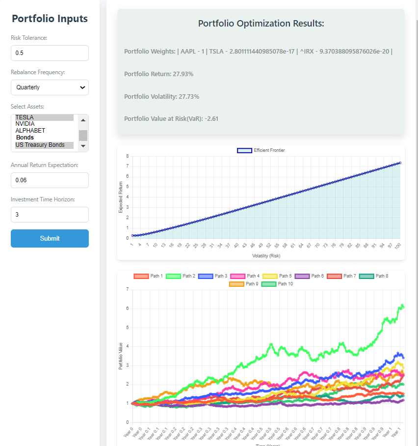

# Portfolio Optimization with Stochastic Control

This project implements a portfolio optimization model that incorporates stochastic control techniques, where asset returns follow stochastic differential equations (SDEs). The model aims to dynamically adjust portfolio weights to handle uncertainty in financial markets.

## Features
- Portfolio optimization using Mean-Variance Optimization and Stochastic Control.
- Asset price modeling via Geometric Brownian Motion (GBM).
- Simulation of future asset price paths using Monte Carlo simulations.
- Efficient Frontier plotting for portfolio risk-return analysis.
- Implementation of optimal stopping theory to rebalance the portfolio.
- Risk-neutral pricing for derivative options.


##
1. Clone the repository:
```bash
$ git clone https://github.com/7bbg/SDE-PORTFOLIO-OPTIMIZER.git 
$ cd SDE-PORTFOLIO-OPTIMIZER
```


2. Install dependencies:
`
pip install -r requirements.txt`

3. `src/config.py` is used to set user preferences (assets, risk tolerance, etc.).

4. Run the main application:
`python src/main.py`

5. Install dependencies for frontend and run the frontend application: 
```bash
$ cd frontend
$ npm install
$ npx electron .
```


## Structure
- **data/**: Contains raw and processed financial data.
- **src/**: Python modules for portfolio optimization, data handling, simulations, api, etc..
- **tests/**: Unit tests for each module. To run tests 
        ` python -m unittest discover -s tests`


## Demo (In progress)
